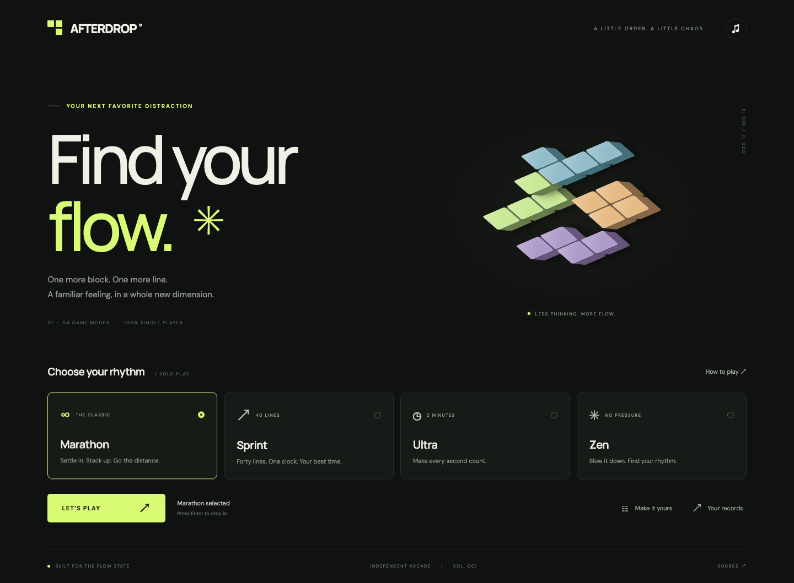
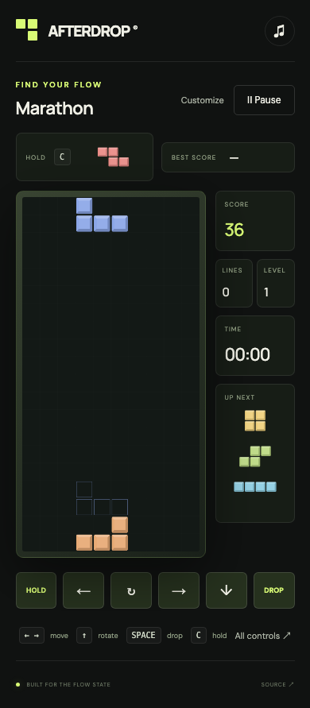

<div align="center">


# A F T E R D R O P

### A little order. A little chaos.

A tactile falling-block arcade. Four ways to play. One more reason to say *one more game*.

[**PLAY AFTERDROP ↗**](https://platret.github.io/afterdrop/) · [The modes](#four-ways-to-find-your-flow) · [Run locally](#make-yourself-at-home)


[](https://github.com/platret/afterdrop/actions/workflows/pages.yml)



</div>

## Find your flow.

Afterdrop pairs the familiar joy of falling blocks with a quiet, carefully composed interface: acid-yellow accents, warm typography, a floating block sculpture, and beveled tiles that feel like small objects. Open it, choose a rhythm, and drop in.

No accounts, no ads, no multiplayer queues. Just you and the next piece.

## Four ways to find your flow

| Mode | The challenge | Your record |
| :--- | :--- | :--- |
| **∞ Marathon** | Keep clearing as gravity speeds up every ten lines. | Highest score |
| **↗ Sprint** | Clear 40 lines as quickly as you can. | Fastest completed time |
| **◷ Ultra** | Score as much as possible in two minutes. | Highest score |
| **✳ Zen** | Enjoy a gentle, fixed falling speed. | Highest score |

All modes use the same 10 × 20 board. Stacking to the top ends a run, including Zen. Exiting an unfinished run discards it.

## The details make the difference

- **Tactile depth.** Beveled Canvas blocks and a CSS isometric menu sculpture; toggle the block shading for a flat look.
- **A sound of its own.** An original ambient synth sequence generated with Web Audio, plus movement, rotation, drop, and clear cues. Music and effects have independent volume controls.
- **Your signature look.** Citrus Studio, Neon Nights, and Soft Monochrome palettes, a landing-ghost toggle, and an ambient-motion setting.
- **A fair next piece.** Shuffled seven-piece bags, three upcoming previews, one hold per turn, wall-kick rotation, a 500 ms lock delay, and up to 15 movement resets per piece.
- **Comfortable controls.** Keyboard repeat for movement and soft drop, plus on-screen touch buttons with press-and-hold repeat.
- **Room to breathe.** Pause and resume whenever you like. Switching tabs or leaving the window automatically pauses active play.
- **A little permanence.** Settings and personal records stay in local storage on your device. Sprint only records successful 40-line runs.
- **Considered access.** Visible focus rings, named controls, keyboard-contained dialogs, and respect for the operating system's reduced-motion preference. The visual Canvas board does not provide a screen-reader equivalent of live gameplay.

Audio begins after an interaction, as required by browsers. Scores and settings do not sync across devices. Clearing browser storage resets them.

## A few good moves

| Key | Action |
| :--- | :--- |
| **← / →** | Move |
| **↑ / X** | Rotate clockwise |
| **Z** | Rotate counterclockwise |
| **↓** | Soft drop · 1 point per cell |
| **Space** | Hard drop · 2 points per cell |
| **C / Shift** | Hold or swap |
| **Esc / P** | Pause / resume |

Clear one, two, three, or four lines for **100 / 300 / 500 / 800 × level** points. Consecutive clearing placements add a combo bonus of **50 × combo × level**. This is an independent falling-block game with its own simplified rotation and scoring rules; it does not implement the official Tetris guideline, T-spin scoring, or back-to-back bonuses.

<details>
<summary><strong>A pocket-sized arcade</strong></summary>
<br />

</details>

## Make yourself at home

Use **Node.js 22.12+** and npm.

```sh
git clone https://github.com/platret/afterdrop.git
cd afterdrop
npm ci
npm run dev
```

Open the URL printed by Vite, including the `/afterdrop/` path.

```sh
npm test                         # Nine engine contract tests
npx playwright install chromium  # Install the browser once
npx playwright test              # Desktop and mobile browser checks
npm run build                    # Strict type check and production build
npm run preview                  # Serve the production build
```

The browser suite starts its own development server when necessary. It checks all four modes, settings persistence, movement-related scoring, hold, pause, touch controls, and narrow-screen overflow. Screenshots are refreshed in `public/`.

## Small by design

```text
src/
├── engine.ts     Game rules, collision, bags, scoring, and mode goals
├── audio.ts      Procedural music and sound effects
├── main.ts       Menus, input, settings, rendering, and the game loop
└── style.css     Visual system, sculpted blocks, and responsive layout
tests/
├── engine.test.ts
└── browser.spec.ts
```

Built with **TypeScript, Vite, Canvas 2D, CSS, and Web Audio**. No production JavaScript dependencies. Typography uses DM Sans and Manrope through Google Fonts, with local sans-serif fallbacks. The depth effects are CSS and Canvas shading, rather than a WebGL scene.

## From commit to arcade

The GitHub Actions workflow installs locked dependencies, runs the engine and browser checks, builds the site, and deploys `dist/` to GitHub Pages after pushes to `main`. Pull requests run the checks without deploying.

The Vite base is `/afterdrop/`. For a different repository name or root-domain deployment, update `vite.config.ts` and the browser-test URLs. In GitHub, set **Settings → Pages → Source → GitHub Actions**.

---

<div align="center">

**Built by [platret](https://github.com/platret). Made for the flow state.**

MIT licensed · Independent falling-block game · Not affiliated with The Tetris Company

</div>
